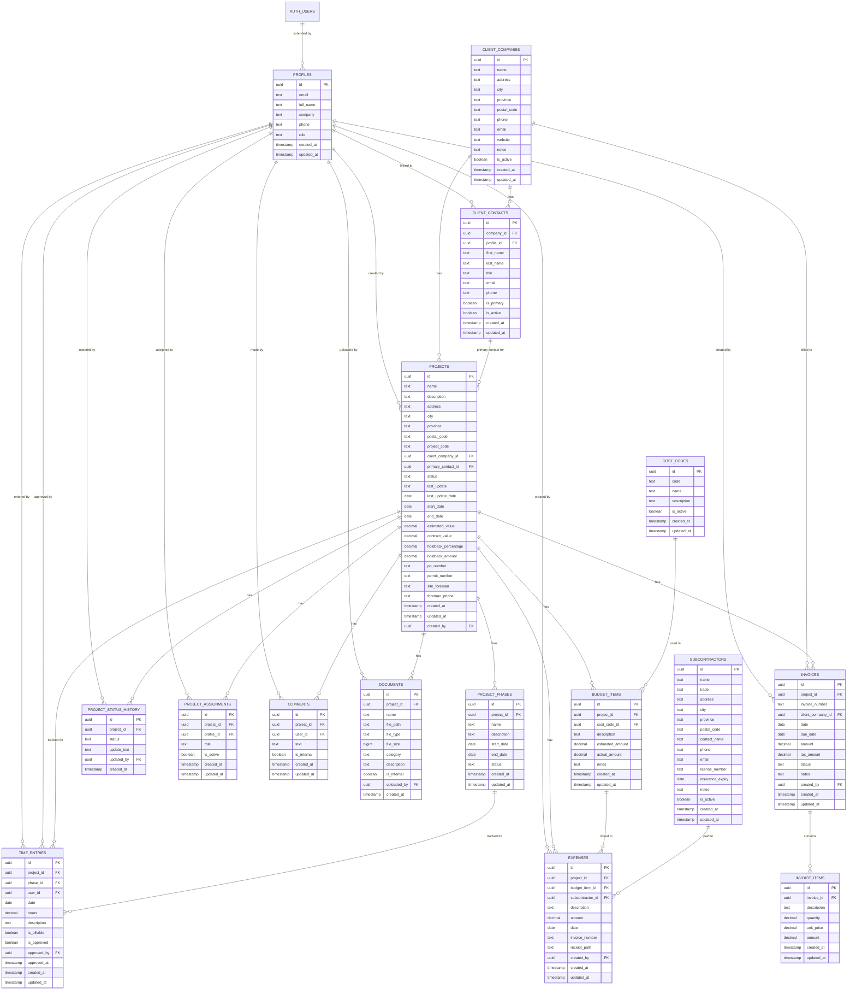

# Seamless Alpha Database Schema Diagram

## Database Schema Overview

The Seamless Alpha database schema is designed for a construction project management application with the following key features:

### Core Entities

- **Profiles**: Extends Supabase auth users with additional information and role (coordinator, client, admin)
- **Client Companies**: Organizations that hire the construction company
- **Client Contacts**: Individuals who represent client companies
- **Projects**: Central entity containing all project information (status, timeline, financials)
- **Subcontractors**: External companies who perform specialized work

### Project Management

- **Project Phases**: Segments of a project with their own timeline and status
- **Project Status History**: Timeline of all status changes with updates
- **Project Assignments**: Team member assignments to projects with specific roles

### Financial Management

- **Cost Codes**: Standard categories for budgeting and expense tracking
- **Budget Items**: Line items in a project budget
- **Expenses**: Actual costs incurred on projects
- **Invoices & Invoice Items**: Billing to clients

### Communication & Documentation

- **Comments**: Discussion threads on projects (internal or client-visible)
- **Documents**: Files attached to projects (categorized and permission-controlled)

### Time Tracking

- **Time Entries**: Hours logged against projects and phases

## Security Model

- Row-Level Security (RLS) policies ensure:
  - Clients can only see their own projects
  - Internal notes and documents remain private from clients
  - Only coordinators and admins can create/modify most entities
  - Helper functions determine access rights for complex cases

## Performance Optimizations

- Strategic indexing on:
  - Foreign keys for relationship lookups
  - Frequently queried fields (status, dates, codes)
  - Text search fields using GIN indexes
  - Status filters and date ranges

## Realtime Updates

- Configured for projects, status history, comments, and phases to enable instant updates across clients

## Triggers & Automation

- Automatic timestamp maintenance
- Status change recording
- Holdback amount calculation